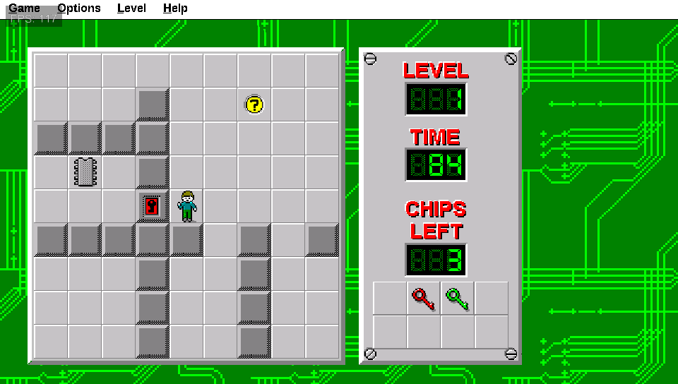
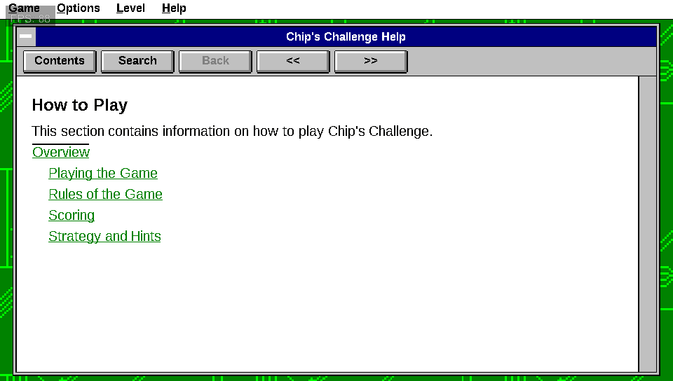
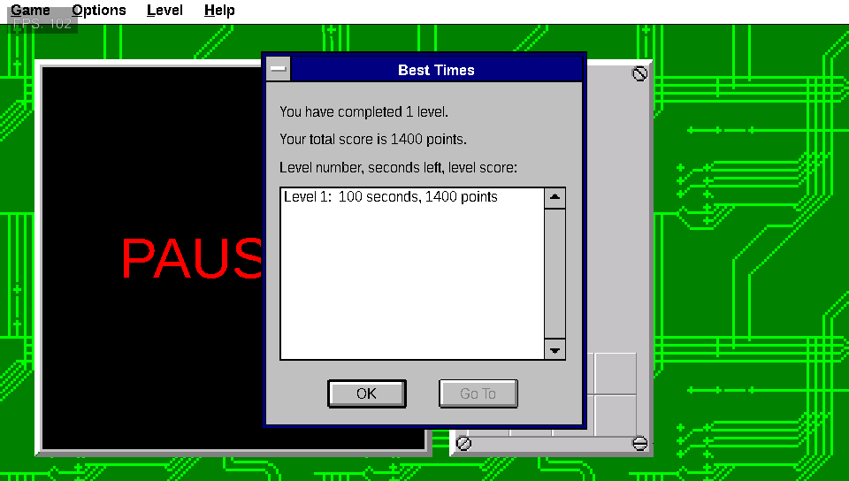

# Vita Chips Challenge

[](LICENSE)

A native PS Vita port of the Microsoft Windows 3.x version of
**Chip's Challenge**, rebuilt in C from the original 16-bit Windows program.



The game logic, menus, dialogs, scoring, saves, help, sound, music, and
ending follow the Windows release: all 149 levels, the original monster
behaviour and timing, passwords, Best Times, the Level Complete dialog, the
hint window, and the original 16-colour graphics. Notes on how each part was
reconstructed are in [`docs/RECONSTRUCTION.md`](docs/RECONSTRUCTION.md), and
the per-feature status is in [`docs/COMPATIBILITY.md`](docs/COMPATIBILITY.md).

| | |
|---|---|
|  |  |

## You need your own copy of the game

The VPK contains no Chip's Challenge game data. You need the Windows 3.x
release of Chip's Challenge (from Microsoft Entertainment Pack / Best of
Windows Entertainment Pack), with these files:

`CHIPS.EXE`, `CHIPS.DAT`, `CHIPS.HLP`, `WEP4UTIL.DLL`, `CHIP01.MID`,
`CHIP02.MID`, `BLIP2.WAV`, `BUMMER.WAV`, `CLICK3.WAV`, `DITTY1.WAV`,
`DOOR.WAV`, `OOF3.WAV`, `POP2.WAV`, `STRIKE.WAV`, `TELEPORT.WAV`,
`WATER2.WAV`

Each file is checked against the supported release; the expected SHA-256
values are in [`tools/extract_reference.py`](tools/extract_reference.py).

## Installing

1. Install `VitaChipsChallenge.vpk` from the
   [latest release](https://github.com/TheGh0stShip/VitaChipsChallenge/releases/latest)
   with VitaShell.
2. Make the data pack on your PC (Python 3 and Pillow):

   ```sh
   python3 -m pip install Pillow
   python3 tools/make_datapack.py path/to/chips_challenge.zip
   ```

   The source can be a .zip or a folder with the files above. The pack is
   written to `build-vita/datapack/VitaChipsChallenge`.
3. Copy that `VitaChipsChallenge` folder to `ux0:data/` on the Vita, for
   example over VitaShell's FTP server, so you end up with
   `ux0:data/VitaChipsChallenge/data/CHIPS.DAT`.

Progress is saved in `ux0:data/VitaChipsChallenge/entpack.ini`, the same
format the Windows game kept in `ENTPACK.INI`.

## Controls

| Vita | Windows | Action |
|---|---|---|
| D-pad | Arrow keys | Move Chip |
| Touch the board | Mouse click | Walk Chip toward a square |
| Start | Alt / F10 | Menu bar |
| Select | F3 | Pause |
| Triangle | Ctrl+R | Restart level |
| L / R | Ctrl+P / Ctrl+N | Previous / next level |
| Cross / Circle | Enter / Esc | Dialog buttons |

Text fields in Go To and Password Entry open the Vita keyboard. Sound
Effects and Background Music start switched off, as in the original; turn
them on from the Options menu.

## Building

Requires [VitaSDK](https://vitasdk.org/) with SDL2 and SDL2_ttf, CMake,
Ninja, and Python 3 with Pillow.

```sh
python3 tools/build_vita.py --release      # VPK without game data
python3 tools/build_vita.py --source path/to/chips_challenge.zip
                                           # VPK with your game data inside
```

Host tests for the game core:

```sh
cmake -S . -B build-host -G Ninja
cmake --build build-host
ctest --test-dir build-host
```

## Music

The game's MIDI songs are played by a built-in OPL2-style FM synthesizer
using the base-level channels a Windows 3.1 FM sound card received, with
the Freedoom GENMIDI instrument bank.

## License

The source code is licensed under the **GNU General Public License,
version 3 only**; see [`LICENSE`](LICENSE).

Chip's Challenge names, characters, game data, and artwork belong to their
respective rights holders and are not covered by the GPL. Fonts and the
instrument bank are under their own licenses; see
[`THIRD_PARTY.md`](THIRD_PARTY.md).
