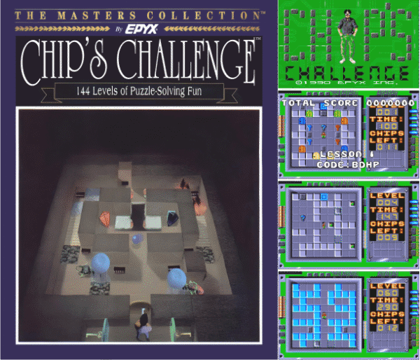
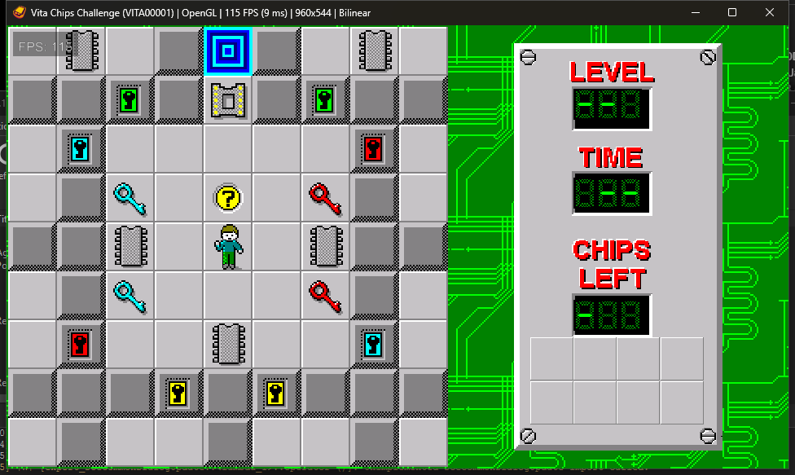

# VitaChipsChallenge

[](LICENSE)





A clean source reconstruction and native PS Vita port of the Microsoft Windows
3.x version of **Chip's Challenge**.

## Status

Reverse engineering is in progress from the original 16-bit Windows NE
executable. The repository builds a native Vita VPK which loads all 149
original levels, renders the original Windows resources and 16 color palette,
accepts Vita controls, and runs a growing reconstructed gameplay core. It is a
development preview. Monster timing and edge cases, complete sliding behavior,
teleports, traps, clone machines, scoring, music, saves, menus, dialogs, and
reference-accurate progression still need completion.

The evidence and feature gate are maintained in
[`docs/COMPATIBILITY.md`](docs/COMPATIBILITY.md). It is the authoritative list
of what is confirmed, partial, or missing.

This project does not use Tile World or another clone as its gameplay engine.
Every reconstructed subsystem will be tied to behavior or code observed in the
reference executable and verified independently.

## Reference build

| File | SHA-256 |
|---|---|
| `chips_challenge.zip` | `ffbb83dc4ca5cc9e8cbf78271b44a42ea4e7db2f4f8d1953383390acf94e7ddf` |
| `CHIPS.EXE` | `8e26acd67cf120bd5b512de4b4e78b80aca1579413cd04f3b2b68909a375866c` |
| `CHIPS.DAT` | `b0a68f21642447385512e0ed9386a4a13a4f7e9a38f909da772104d8e6b5c1fb` |
| `WEP4UTIL.DLL` | `40a405813946caac1aa2ec3e31fa570de1c418f8db43182d614e0bac4e1978cb` |

The original files are not distributed by this repository. See
[`reference/README.md`](reference/README.md) for local setup.

## Target

The Vita is little-endian ARMv7-A with a 32-bit ILP32 ABI. The original program
is 16-bit x86 code using the Windows 3.x NE segmented executable format. The
port translates reconstructed game logic into portable fixed-width C and uses
a Vita-native platform layer for rendering, input, audio, storage, and lifecycle
events.

## Roadmap

1. Inventory NE segments, resources, imports, exports, and relocation records.
2. Reconstruct DAT loading, game state, tile interactions, timing, and movement.
3. Match reference behavior with host-side differential fixtures.
4. Implement Vita graphics, controls, audio, persistence, and LiveArea assets.
5. Validate ARMv7-A ABI attributes and complete physical Vita/PSTV testing.

No gold release will be declared until the reconstructed engine passes the
behavior corpus and the exact VPK passes the physical-device checklist.

## Personal Vita build

Install VitaSDK, place the verified `chips_challenge.zip` in `reference/`, then
run:

```sh
python3 -m pip install Pillow
python3 tools/build_vita.py
```

The result is `build-vita/VitaChipsChallenge.vpk`. The build extracts the DAT
and sprite sheet locally from the supplied Windows release. The bubble icon,
splash, and LiveArea background combine the original Windows sprites with
archived retail imagery recorded in `assets/branding/README.md`. Original game
data and generated packages stay ignored by Git.

### Controls

| Control | Action |
|---|---|
| D-pad | Move Chip |
| Cross | Restart after failure; continue after completion |

## Host reconstruction build

```sh
cmake -S . -B build-host -G Ninja -DCMAKE_BUILD_TYPE=Debug
cmake --build build-host
```

## License

Copyright © 2026 VitaChipsChallenge contributors.

The source code and original project documentation are free software licensed
under the **GNU General Public License, version 3 only** (`GPL-3.0-only`). You
may redistribute and modify them under GPLv3. The complete, unmodified license
text is in [`LICENSE`](LICENSE).

Chip's Challenge game data, names, characters, screenshots, retail artwork,
and other third-party material remain the property of their respective rights
holders. They are not relicensed under GPLv3. See
[`assets/branding/README.md`](assets/branding/README.md) for provenance and
[`THIRD_PARTY.md`](THIRD_PARTY.md) for the repository licensing boundary.
